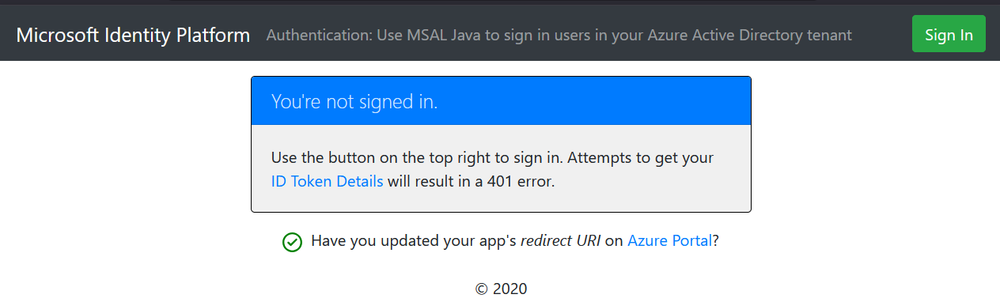

## 概述

此示例演示了一个 Java Servlet Web 应用程序，该应用使用 [Microsoft 身份验证库 (MSAL) for Java](https://github.com/AzureAD/microsoft-authentication-library-for-java) 将用户登录到 Microsoft Entra 租户，并获取app的授权token。


## 场景

1. 此 Web 应用程序使用 **MSAL for Java (MSAL4J)** 将用户登录到其 Microsoft Entra 租户，并从 **Microsoft Entra ID** 获取 [ID 令牌](https://docs.microsoft.com/azure/active-directory/develop/id-tokens)。
2. **ID 令牌** 证明用户已成功通过此租户的身份验证。

## 目录结构

| 文件/文件夹                                                        | 描述                                                                            |
| ------------------------------------------------------------------ | -------------------------------------------------------------------------------------- |
| `src/main/java/com/microsoft/azuresamples/msal4j/authwebapp/`      | 此目录包含定义 Web 应用后端业务逻辑的类。  |
| `src/main/java/com/microsoft/azuresamples/msal4j/authservlets/`    | 此目录包含用于登录和注销端点的类。  |
| `____Servlet.java`                                                 | 所有可用的端点都定义在以 ____Servlet.java 结尾的 .java 类中。|
| `src/main/java/com/microsoft/azuresamples/msal4j/helpers/`         | 身份验证辅助类。                                                     |
| `AuthenticationFilter.java`                                        | 将未经身份验证的请求重定向到受保护端点的 401 页面。               |
| `src/main/resources/authentication.properties`                     | Microsoft Entra ID 和程序配置。                                                    |
| `src/main/webapp/`                                                 | 此目录包含 UI（JSP 模板）                                         |

## 先决条件

- [JDK 8 或更高版本](https://jdk.java.net/8/)
- [Maven 3](https://maven.apache.org/download.cgi)
- Microsoft Entra 租户。有关如何获取 Microsoft Entra 租户的更多信息，请参阅[如何获取 Microsoft Entra 租户](https://azure.microsoft.com/documentation/articles/active-directory-howto-tenant/)
- 您自己的 Microsoft Entra 租户中的用户账户


## 设置

### 注册 Web 应用 (java-servlet-webapp-authentication)

在 [Microsoft Entra 管理中心](https://entra.microsoft.com) [注册一个新的 Web 应用](https://docs.microsoft.com/azure/active-directory/develop/quickstart-register-app)。
按照以下步骤，您必须：

1. 进入到 Microsoft 身份平台开发人员 [应用注册](https://go.microsoft.com/fwlink/?linkid=2083908) 页面。
1. 选择 **新建注册**。
1. 在出现的 **注册应用程序** 页面中，输入您的应用程序注册信息：
   - 在 **名称** 部分，输入一个有意义的应用程序名称，该名称将显示给应用程序的用户，例如 `java-servlet-webapp-authentication`。
   - 在 **支持的账户类型** 下，选择一个选项。
     - 如果您正在构建仅供租户中用户使用的应用程序，请选择 **仅限此组织目录中的账户**（**单租户**）。
     - 如果您希望任何 Microsoft Entra 租户中的用户都能使用您的应用程序，请选择 **任何组织目录中的账户**（**多租户**）。
     - 对于最广泛的客户群体，请选择 **任何组织目录中的账户和个人 Microsoft 账户**（**多租户**，同时支持 Microsoft 个人账户）。
   - 如果仅供个人 Microsoft 账户用户使用（例如 Hotmail、Live、Skype、Xbox 账户），请选择 **个人 Microsoft 账户**。
   - 在 **重定向 URI** 部分，在下拉框中选择 **Web** 并输入以下重定向 URI：`http://localhost:8080/msal4j-servlet-auth/auth/redirect`。
1. 选择 **注册** 以创建应用程序。
1. 在应用的注册屏幕中，找到并记录 **应用程序（客户端）ID**。您稍后将在代码的配置文件中使用此值。
1. 选择 **保存** 以保存更改。
1. 在应用的注册屏幕中，点击左侧的 **证书和密钥** 边栏选项卡，打开可以生成密钥和上传证书的页面。
1. 在 **客户端密钥** 部分，点击 **新建客户端密钥**：
   - 输入密钥描述（例如 `app secret`），
   - 根据您的安全需求选择可用的密钥持续时间之一（**1 年后**、**2 年后** 或 **永不过期**）。
   - 点击 **添加** 按钮后将显示生成的密钥值。复制生成的值以供后续步骤使用。
   - 您稍后将在代码的配置文件中需要此密钥。此密钥值不会再次显示，也无法通过任何其他方式检索，因此请确保在导航到任何其他屏幕或边栏选项卡之前从 Microsoft Entra 管理中心记录下来。

### 配置 Web 应用 (java-servlet-webapp-authentication) 以使用您的应用注册

在 IDE 中打开项目以配置代码。

> 在以下步骤中，"ClientID" 与 "Application ID" 或 "AppId" 相同。

1. 打开 `./src/main/resources/authentication.properties` 文件
2. 找到字符串 `{enter-your-tenant-id-here}`。将现有值替换为：
    - 如果您使用 **仅限此组织目录中的账户** 选项注册了应用，则替换为 **您的 Microsoft Entra 租户 ID**。
    - 如果您使用 **任何组织目录中的账户** 选项注册了应用，则替换为单词 `organizations`。
    - 如果您使用 **任何组织目录中的账户和个人 Microsoft 账户** 选项注册了应用，则替换为单词 `common`。
    - 如果您使用 **个人 Microsoft 账户** 选项注册了应用，则替换为单词 `consumers`。
3. 找到字符串 `{enter-your-client-id-here}` 并将现有值替换为从 Microsoft Entra 管理中心复制的 `java-servlet-webapp-authentication` 应用程序的应用程序 ID（clientId）。
4. 找到字符串 `{enter-your-client-secret-here}` 并将现有值替换为您在 Microsoft Entra 管理中心创建 `java-servlet-webapp-authentication` 应用时保存的密钥。

## 运行示例
#### 使用 Maven 构建 .war 文件

1. 导航到包含此示例的 pom.xml 文件的目录（与此 README 相同的目录），并运行以下 Maven 命令：
    ```
    mvn clean package
    ```
1. 这将生成一个 `.war` 文件，可以在各种应用程序服务器上运行

#### 部署示例

将生成的 `.war` 文件放入 `webapps` 文件夹中，然后重启 Tomcat 服务器。

#### 访问示例


https://github.com/user-attachments/assets/09803602-1a6f-48d3-a4f9-6c521f06512f

## 关于代码

在 [AuthHelper.java] 类中创建了一个 **ConfidentialClientApplication** 实例。此对象帮助构建 Microsoft Entra 授权 URL，并帮助将身份验证令牌交换为访问令牌。

```Java
// getConfidentialClientInstance 方法
IClientSecret secret = ClientCredentialFactory.createFromSecret(SECRET);
confClientInstance = ConfidentialClientApplication
                    .builder(CLIENT_ID, secret)
                    .authority(AUTHORITY)
                    .build();
```

实例化时需要提供以下参数：

- 应用的 **客户端 ID**
- **客户端密钥**，这是机密客户端应用程序的必需项
- **Microsoft Entra 颁发机构**，其中包含您的 Microsoft Entra 租户 ID。

在此示例中，这些值从 [authentication.properties] 文件中读取。

### 分步演练

1. 登录过程的第一步（入口在`SignInServlet`类的**doGet**方法），是向我们的 Microsoft Entra 租户的 `/authorize` 端点发送请求。我们利用 MSAL4J `ConfidentialClientApplication` 实例来构建授权请求 URL。我们的应用将浏览器重定向到此 URL，用户将在此处登录。

    ```Java
    final ConfidentialClientApplication client = getConfidentialClientInstance();
    AuthorizationRequestUrlParameters parameters = AuthorizationRequestUrlParameters.builder(Config.REDIRECT_URI, Collections.singleton(Config.SCOPES))
            .responseMode(ResponseMode.QUERY).prompt(Prompt.SELECT_ACCOUNT).state(state).nonce(nonce).build();

    final String authorizeUrl = client.getAuthorizationRequestUrl(parameters).toString();
    contextAdapter.redirectUser(authorizeUrl);
    ```

    - **AuthorizationRequestUrlParameters**：构建 AuthorizationRequestUrl 时必须设置的参数。
    - **REDIRECT_URI**：收集用户凭据后，Microsoft Entra ID 将浏览器重定向到此处（连同授权代码）。它必须与 [Microsoft Entra 管理中心](https://entra.microsoft.com) 上 Microsoft Entra 应用注册中的重定向 URI 匹配。
    - **SCOPES**：[作用域](https://docs.microsoft.com/azure/active-directory/develop/access-tokens#scopes) 是应用程序请求的权限。
      - 通常，三个作用域 `openid profile offline_access` 足以接收 ID 令牌响应。
      - 应用请求的完整作用域列表可以在 [authentication.properties 文件](./src/main/resources/authentication.properties) 中找到。您可以添加更多作用域，如 User.Read 等。

2. Microsoft Entra ID 向用户显示登录提示。如果登录尝试成功，用户的浏览器将重定向到我们应用的重定向端点（此端点是在EntraID中应用注册时，设置的**重定向 URI**）。对此端点的有效请求将包含一个 [**授权代码**](https://docs.microsoft.com/azure/active-directory/develop/v2-oauth2-auth-code-flow)。例如：`http://localhost:8080/msal4j-servlet-auth/auth/redirect?code=1.ASsA9hTFCSe...`。浏览器重定向将由`AADRedirectServlet`类的**doGet**方法响应处理
3. 然后，在`AuthHelper::processAADCallback`方法中，我们的 ConfidentialClientApplication 实例将此授权代码交换为来自 Microsoft Entra ID 的 ID 令牌和访问令牌。

    ```Java
    // 首先，验证 state，然后解析响应中的任何错误代码，然后提取 authCode。然后：
    // 构建授权代码参数：
    final AuthorizationCodeParameters authParams = AuthorizationCodeParameters
            .builder(authCode, new URI(Config.REDIRECT_URI)).scopes(Collections.singleton(Config.SCOPES)).build();

    // 获取客户端实例并利用它来获取令牌：
    final ConfidentialClientApplication client = AuthHelper.getConfidentialClientInstance();
    final IAuthenticationResult result = client.acquireToken(authParams).get();
    ```

    - **AuthorizationCodeParameters**：将授权代码交换为 ID 和/或访问令牌时必须设置的参数。
    - **authCode**：在重定向端点接收到的授权代码。
    - **REDIRECT_URI**：必须再次传递上一步中使用的重定向 URI。
    - **SCOPES**：必须再次传递上一步中使用的作用域。

4. 如果 `acquireToken` 成功，则提取令牌声明。如果 nonce 检查通过，结果将放入 `context`（`IdentityContextData` 的实例）并保存到会话中。然后，应用程序可以在需要访问时从会话中实例化它（通过 `IdentityContextAdapterServlet` 的实例）：

    ```java
    // 从 IAuthenticationResult 解析 IdToken 声明：
    // （下一步 - validateNonce - 需要解析的声明）
    context.setIdTokenClaims(result.idToken());

    // 如果 nonce 无效，立即停止！这可能是令牌重放！
    // 如果验证失败，抛出异常并取消身份验证：
    validateNonce(context);

    // 设置用户为已认证：
    context.setAuthResult(result, client.tokenCache().serialize());
    ```

### 作用域

- [作用域](https://docs.microsoft.com/azure/active-directory/develop/v2-permissions-and-consent) 告诉 Microsoft Entra ID 应用程序请求的访问级别。
- 根据请求的作用域，Microsoft Entra ID 在用户登录时向用户显示同意对话框。
- 如果用户同意一个或多个作用域并获得令牌，则同意的作用域将被编码到生成的 `access_token` 中。
- 请参阅 [authentication.properties](./src/main/resources/authentication.properties) 了解应用程序请求的作用域。这三个作用域由 MSAL 请求，并由 Microsoft Entra ID 默认授予。


## 更多信息

- [Microsoft 身份验证库 \(MSAL\) for Java](https://github.com/AzureAD/microsoft-authentication-library-for-java)
- [MSAL Java 参考文档](http://javadoc.io/doc/com.microsoft.azure/msal4j)
- [Microsoft 身份平台（面向开发人员的 Microsoft Entra ID）](https://docs.microsoft.com/azure/active-directory/develop/)
- [快速入门：在 Microsoft 身份平台注册应用程序（预览版）](https://docs.microsoft.com/azure/active-directory/develop/quickstart-register-app)
- [了解 Microsoft Entra 应用程序同意体验](https://docs.microsoft.com/azure/active-directory/develop/application-consent-experience)
- [了解用户和管理员同意](https://docs.microsoft.com/azure/active-directory/develop/howto-convert-app-to-be-multi-tenant#understand-user-and-admin-consent)
- [MSAL 代码示例](https://docs.microsoft.com/azure/active-directory/develop/sample-v2-code)
